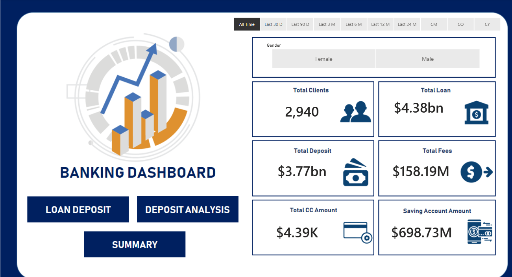
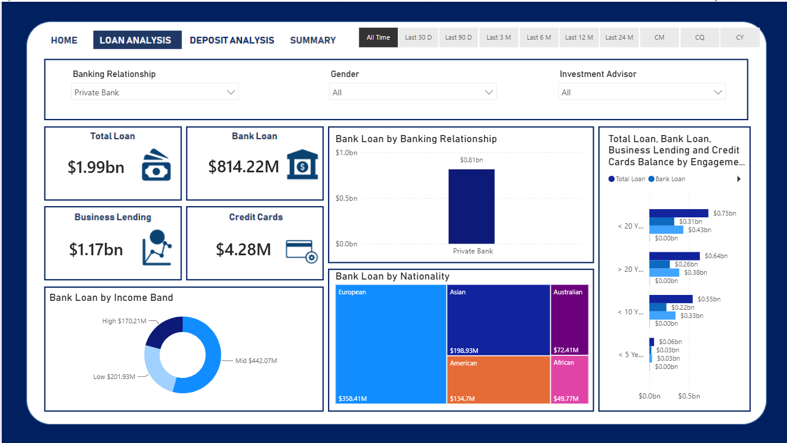
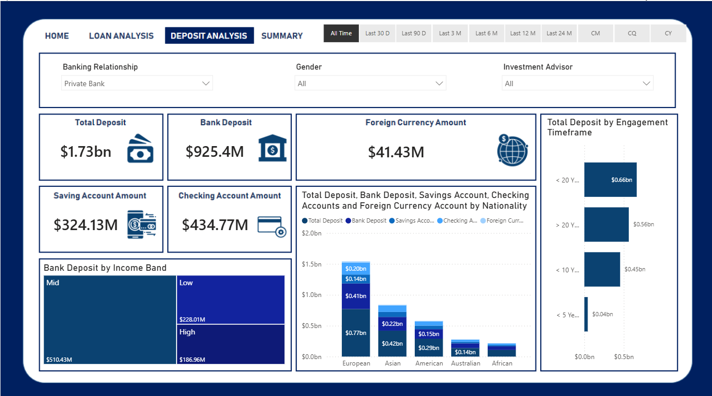
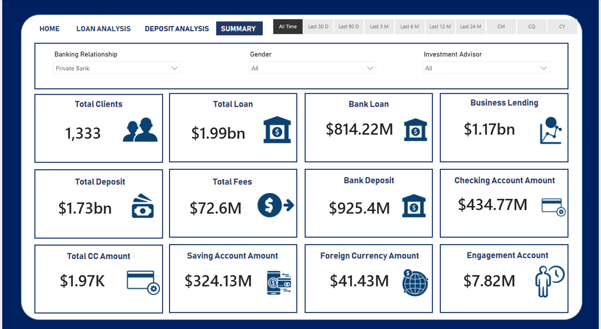
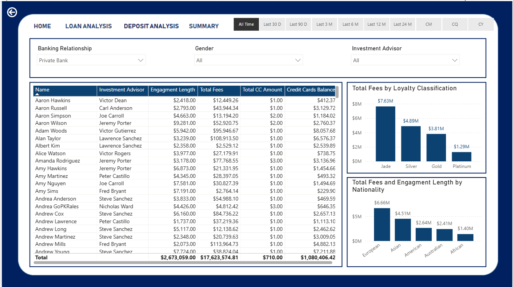

# 🏦 Banking Customer Analytics & Financial Performance Dashboard

An enterprise-grade Power BI business intelligence dashboard analyzing private banking customer portfolios, retail deposits, multi-tier lending exposure, fee structures, and client engagement demographics.

---

## 🖥️ Interactive Dashboard Showcase

### 1. Executive Banking Portal (Overview)
> High-level summary displaying portfolio liquidity, total lending exposure, customer deposit holdings, and fee collection.



---

### 2. Loan Portfolio Analysis
> Deep dive into bank lending, business borrowing lines, customer income bands, client nationality exposure, and relationship tenure.



---

### 3. Deposit & Liquidity Analysis
> Breakdown of client deposit composition across Checking, Savings, and Foreign Currency accounts mapped against customer demographics.



---

### 4. Executive KPI Summary
> Consolidated high-level executive cards tracking core balance sheet metrics for private banking relationships.



---

### 5. Client Portfolio & Fee Intelligence
> Granular client-level accounting ledger evaluating investment advisor allocations, engagement lengths, loyalty tier classifications, and fee generation.



---

## 📈 Key Performance Indicators (KPIs)

| Metric | Portfolio Value | Strategic Significance |
| :--- | :--- | :--- |
| **Total Analyzed Clients** | **2,940 Accounts** (1,333 Private Bank Focus) | Core wealth & private banking relationship base |
| **Total Loan Exposure** | **$4.38 Billion** ($1.99B Private Bank) | Asset portfolio across Bank Loans & Business Lending |
| **Total Deposits Held** | **$3.77 Billion** ($1.73B Private Bank) | Stable funding pool across Checking & Savings accounts |
| **Total Fee Revenue** | **$158.19 Million** | Non-interest revenue generated through wealth management |
| **Savings Account Capital** | **$698.73 Million** | Retail liquidity reserve |
| **Foreign Currency Holdings** | **$41.43 Million** | Cross-border wealth diversification |

---

## 💡 Core Business Insights

* **Lending Portfolio Composition:**
  * In the Private Banking division, **Business Lending dominates at $1.17 Billion**, surpassing conventional **Bank Loans ($814.22 Million)**.
  * Borrowing is heavily concentrated in the **Middle Income Band ($442.07M)**, followed by Low Income ($201.93M) and High Income ($170.21M) tiers.
* **Geographic & Demographic Distribution:**
  * **European clients** represent the largest share of credit lines ($358.41M in bank loans) and deposits ($770M+ in core deposits), followed by **Asian clients** ($198.93M loans, ~$420M deposits).
  * Long-term clients (**10–20+ year engagement**) hold the vast majority of lending volume (>$1.39B combined).
* **Fee Generation by Loyalty Tier:**
  * Fee collection is led by the **Jade tier ($7.63M)** and **Silver tier ($4.89M)**, while **Platinum accounts ($1.29M)** indicate an opportunity to expand advisory cross-selling.

---

## 🛠️ Tools & Technical Implementation

* **Business Intelligence Tool:** Microsoft Power BI Desktop
* **Data Modeling:** Star Schema connecting Client Demographics, Account Balances, Loan Products, and Advisor Portfolios.
* **DAX Formulas:** Developed measures for dynamic currency conversions, time-intelligence filtering (CY, CQ, CM, Last 30D–24M), and loyalty tier fee aggregations.
* **UX/UI Design:** Designed custom multi-page navigation menus (Home, Loan Analysis, Deposit Analysis, Summary) with interactive slicers for Gender, Advisory Team, and Banking Segment.

---

## 📂 Repository Structure

```text
├── banking_home_dashboard.png         # Main landing overview
├── loan_analysis_dashboard.png        # Loan analysis report page
├── deposit_analysis_dashboard.png     # Deposit analysis report page
├── kpi_summary_dashboard.png          # Executive KPI summary cards
├── client_detail_summary.png          # Client fee matrix & loyalty analysis
├── Banking_Customer_Analytics.pbix    # Interactive Power BI workbook
├── Banking_Customer_Data.xlsx         # Underlying sanitized financial records
└── README.md                          # Project documentation
